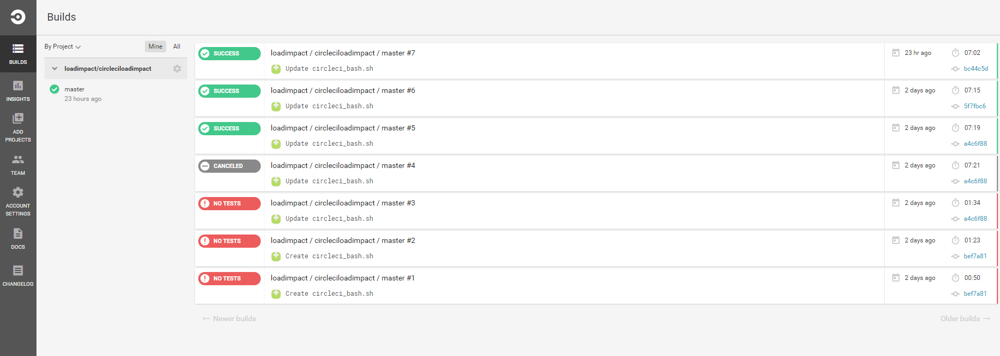
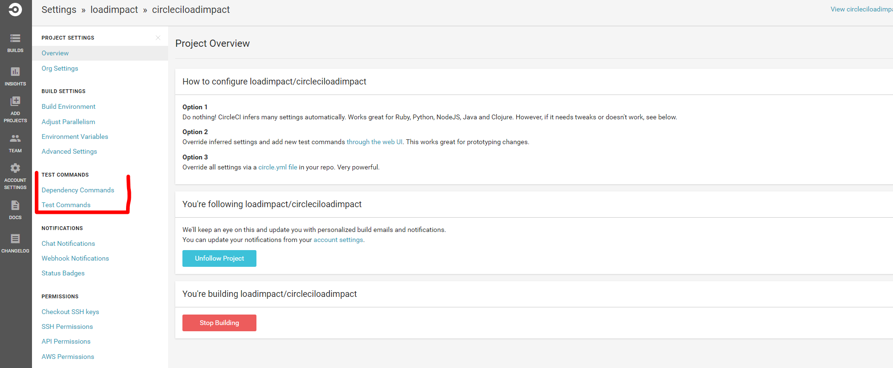
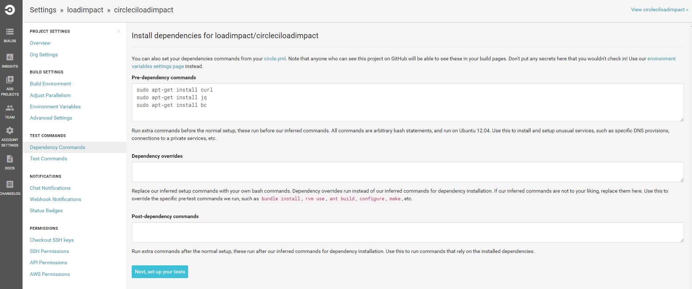
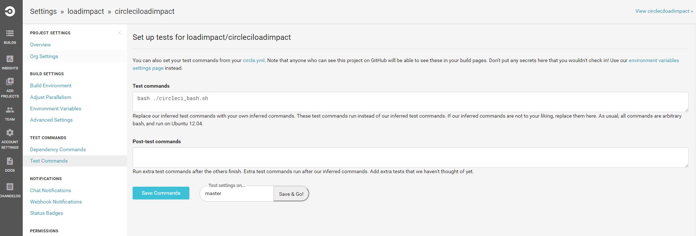
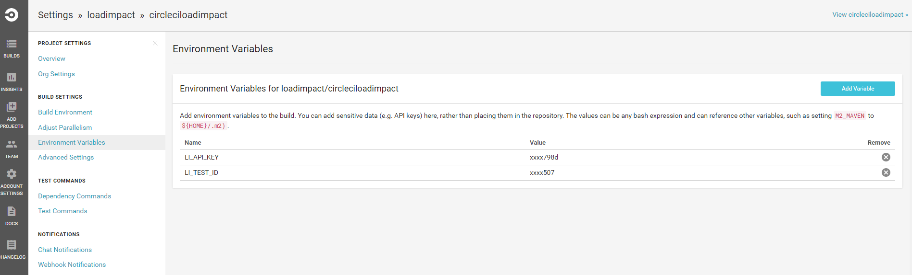
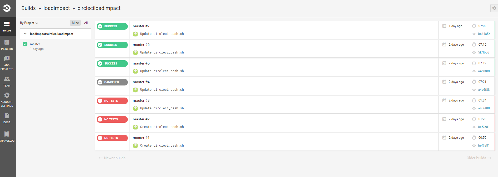
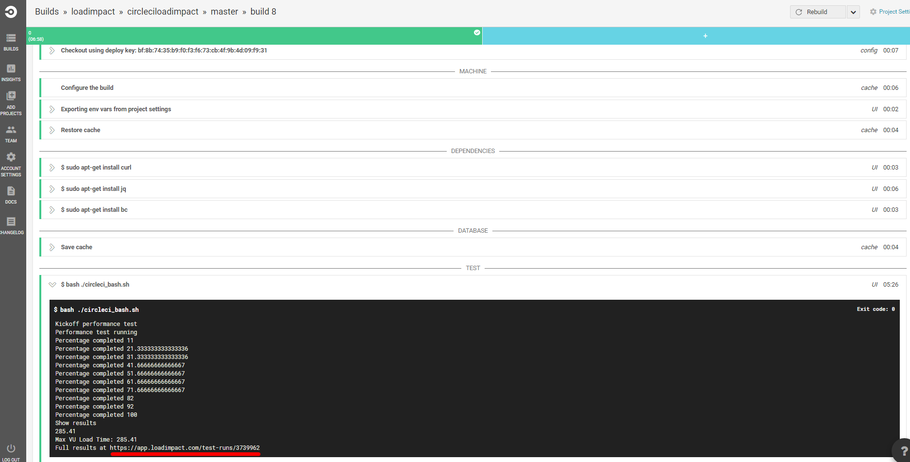

Automated Performance Testing with CircleCi
===========================================

<embed src="media/image1.png" width="98" height="100" /> **CircleCi**

Load Impact integrates nicely with CircleCi, continuous integration and delivery platform. Using our robust and extensible APIs you can integrate Load Impact’s world-leading performance testing platform into your automated CircleCi build and test process.

Load Impact covers your back with everything you need for Web, API and application performance testing. And test scripting is simple.

To get started, try this sample of how to include performance testing in your CircleCi build setup.

Continuous Delivery. Continuous performance feedback. Simple.
-------------------------------------------------------------

This sample assumes you are familiar with [CircleCi](https://circleci.com/). We set up a new project with a simple build containing one test step to run the Load Impact performance test.

Is also assumes you have a Load Impact account. [If not, go get one – it’s free](http://loadimpact.com).

Set up your CircleCi build
==========================

We created a CircleCi project which by default has the name we gave the repository on Github, loadimpact/circleciloadimpact. It’s very simple, everything is just default.



And this is the history when we have executed a couple of times.

So slightly more interesting – let’s take a look at the settings of the build. More precisely the Test Commands.



First part, the dependency commands, we have added three necessary dependencies.

Curl, jq and bc. By default the current build environment on CircleCi already has curl and bc but we include them anyway.



We add the install as pre-dependency commands.



The test command itself is added. It just involves executing the circleci\_bash.sh script in the repository. So the test script itself is also part of the repository.

You can get the code for the circleci\_bash.sh script from github in the [loadimpact/circleciloadimpact](https://github.com/loadimpact/circleciloadimpact) repo where it is shared.

Integrate with the Load Impact API
==================================

Before we dive into the details – let’s get some essentials from your Load Impact account. We need the API key so you can access the API and a test to run.

The API key you get in your Load Impact account when you are logged in


Go to “Monitoring” on the left and click “Use REST API”.

Then copy it from the yellow text box.


Just note that the API token is *longer* than the size of the box so make sure you get all of it!

Now you need to know which test to run. You can list your test configurations using the API or the CLI if you want to but the simplest way is to open it directly in your account and copy the id from the URL. Underlined in red.


So now you have a test id for the test you want to run in your build pipeline and your API key.

All of the code is shared at Github for your download in the [loadimpact/circleciloadimpact](https://github.com/loadimpact/circleciloadimpact) repo!

3a Edit the build settings to set the test Id and the API key
=============================================================

To avoid sticking sensitive information such as your test id and your API key into the script itself we use environment variables set in your build settings to hold these.

Set the environment variable LI\_TEST\_ID to hold your test id and the environment variable LI\_API\_KEY to hold your API key.



Now, let us look into the script code itself that actually executes the tests.

The code has four parts, the initial and then three stages “Kickoff performance test”, “Performance test running” and “Show results”. If you are familiar with CircleCi you know the output from the execution is visible in the build log when you execute your build including the Load Impact performance test.

The initial part of the Bash code is where you set the test id and the API key.

```bash
#!/bin/bash
# Run Load Impact test from bash

# Load Impact test id
# env variable from CircleCi - LI_TEST_ID
testId="$LI_TEST_ID"

# API_KEY from your Load Impact account
# env variable from CircleCi - LI_API_KEY
API_KEY="$LI_API_KEY"

uri="https://api.loadimpact.com/v2/test-configs/$testId/start"
```

So make sure you set the LI\_TEST\_ID and LI\_API\_KEY environment variables!

3b Kick off a performance test
==============================

```bash
echo "Kickoff performance test"

OUT=$(curl -qSfsw "\n%{http_code}" -u $API_KEY: -X POST https://api.loadimpact.com/v2/test-configs/$testId/start)

status=`echo  "${OUT}" | tail -n1`

# Status 201 expected, 200 is just a current running test id
if [[ $status -ne 201 ]] ; then
  perc="Could not start test $testId : $status \n $resp.Content"
  echo "${perc}"
  exit 2
else
  tid=`echo "${OUT}" | head -n1 | jq '.id'`
fi

# Until 5 minutes timout or status is running 

t=0
status_text="\"NOT_YET\""
until [ $status_text == "\"Running\"" ]; do
  sleep 10s
  OUT=$(curl -qSfsw '\n%{http_code}' -u $API_KEY: -X GET https://api.loadimpact.com/v2/tests/$tid/)
  status_text=`echo  "${OUT}" | head -n1 | jq '.status_text'`
  ((t=t+10))

  if [[ $t -gt 300 ]] ; then
    echo "Timeout - test start > 5 min"
    exit 3
  fi
done

echo "Performance test running"
```

We kick off the performance test by gluing together the URI for the [API to start the test](http://developers.loadimpact.com/api/#post-test-configs-id-start) and then write the status to stdout which can be seen in the CircleCi log.

We use curl to make the API call to start the test and then specifically check for the expected 201 response.

If not there we will exit with an exit code of two (2) which will tell CircleCi the test has failed.

If it is good, we parse the json response and extract the running test id.

Then we let it take a maximum of five minutes for the test to actually kickoff. Since it can take Load Impact a couple of minutes to acquire and allocate all the resources (mainly load agents) needed we take some time to let the test reach the status of “Running”. The bigger the test, the more resources needed and the longer it can take. But remember, it’s a couple of minutes.

We get that status of the test by [calling the API](http://developers.loadimpact.com/api/#get-tests-id) and parsing the json response to check for the status in the response. If it takes too long we exit with exit code 3 to tell CircleCi it failed.

The last thing we do is to write a message to stdout that the test is running.

3c The test is running
======================

```bash
# wait until completed

maxVULoadTime=0
percentage=0
until [[ $(echo "$percentage==100" | bc -l) == 1 ]]; do
  sleep 30s

  # Get percent completed
  OUT=$(curl -qSfs -u $API_KEY: -X GET https://api.loadimpact.com/v2/tests/$tid/results?ids=__li_progress_percent_total)

  percentage=`echo "${OUT}" | jq '.__li_progress_percent_total | max_by(.value)| .value'`

  echo  "Percentage completed $percentage"

  # Get VU Load Time
  OUT=$(curl -qSfs -u $API_KEY: -X GET https://api.loadimpact.com/v2/tests/$tid/results?ids=__li_user_load_time)

  maxVULoadTime=`echo "${OUT}" | jq '.__li_user_load_time | max_by(.value) | .value'`

  if [[ $(echo "$maxVULoadTime>1000" | bc -l) == 1 ]] ; then 
    perc="VU Load Time exceeded limit of 1 sec: $maxVULoadTime"
    echo "$perc"
    exit 4
  fi
done
```

So now your Load Impact performance test is running!

This time we wait until the test has completed, reached the percentage completed value of 100% with a slightly longer sleep between refreshing status calls.

We do this by calling the [API for results](http://developers.loadimpact.com/api/#get-tests-id-results) and only requesting the percentage completed. The API returns all of the relevant data so we do some json parsing and just get the max percentage value from the result set.

All the results are available from the API so you can either use them or calculate new aggregate results to use as test thresholds for your pipeline test results.

We included an example of making a threshold from the [VU Load Time (please read the explanation of this value before using it)](http://support.loadimpact.com/knowledgebase/articles/174121-how-do-i-interpret-test-results).

We get the value by calling the same API as before but for the VU Load Time result, parse the json and get the max value by some jq magic.

If the value exceeds 1 second we exit the build step and fail it by setting the exit code to 4. This tells CircleCi it failed and we also write a message on stdout.

3d Show the results
===================

```bash
#show results
echo "Show results"
echo "$maxVULoadTime"
echo "Max VU Load Time: $maxVULoadTime"
echo "Full results at https://app.loadimpact.com/test-runs/$tid"
```

Finally, we show the results and output the max VU Load Time. It can of course be any result but as a sample. You can use this result to decide on further actions in your build as well but that is outside the scope of this sample. And of course we tack on a direct link to the full results and analysis in Load Impact.

Finally, executing the build in CircleCi.
=========================================

Any update in the repository for the build project, in this case only the test script itself, will trigger a build in CircleCi using default settings. Or else you can always start a build manually from CircleCi.



A couple of completed builds.


Once the test is actually running CircleCi will show the output from the test.

And looking into the details of the build log itself we see the steps and the individual messages.



there’s also a direct link to the full results and analysis in Load Impact where you can always find all the results of all your tests.

You can add/update/delete tests, user scenarios and data stores using the API and CLI, even stick all of it in your SCM of choice and let all of it be part of your build.

To dive deeper into using Load Impact from your CI/CD process (or for that matter any external usage) see our [*comprehensive API reference*](http://developers.loadimpact.com/api/) and the accompanying [*CLI*](http://support.loadimpact.com/knowledgebase/articles/833856-automating-load-testing-with-the-load-impact-api).
